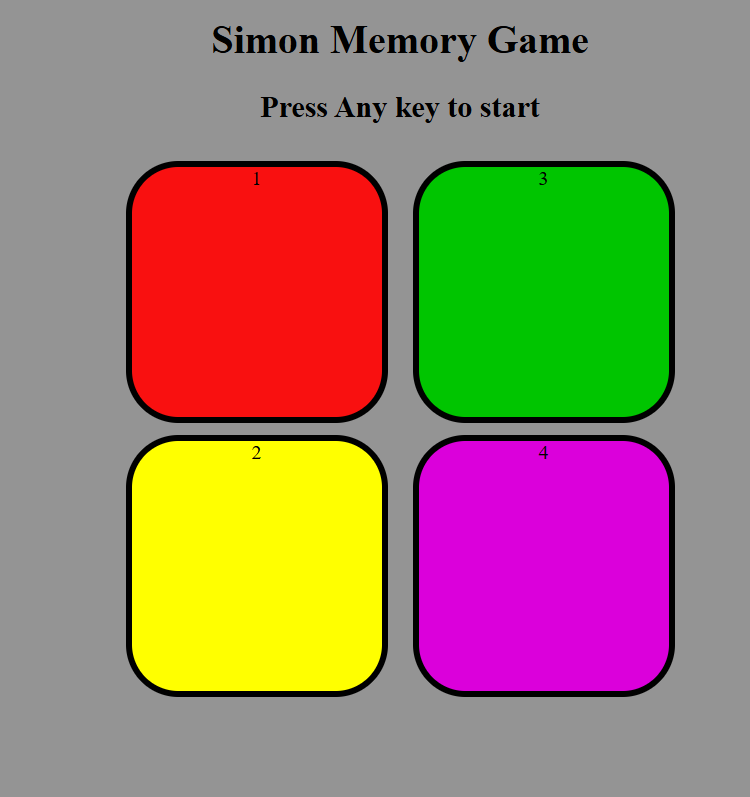

# simon-game

A web-based implementation of the classic Simon Game using HTML, CSS, and JavaScript.

## Features

- Interactive color sequence memory game
- Responsive design for desktop and mobile

## How to Play

1. Press **anykey ** to begin.
2. Watch the sequence of colors
3. Repeat the sequence by clicking the colored buttons.
4. Each round adds a new color to the sequence.
5. The game ends when you make a mistake.

## Demo

## Installation

1. Clone or download this repository.
2. Open `index.html` in your browser.

## Technologies Used
- HTML
- CSS
- JavaScript
